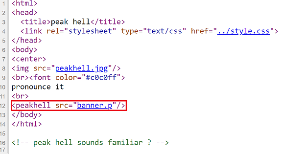
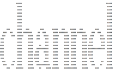

# Challenge #5
**Url**: http://www.pythonchallenge.com/pc/def/peak.html<br/>
## Problem Statement
<br/>
**Hint**: pronounce it


## Resolution
The page header states "peak hell" and the hint tells us to pronounce it. This might have something to do with the pickle library, doesn't it?<br/>
Also, if we carefully check the contents in the page source, we can find a strange tag:
> <br/> 

This leads us to the pickle we have to deserialize with the following code:
```python
import pickle
import requests

link = 'http://www.pythonchallenge.com/pc/def/banner.p'
f = requests.get(link)
decoding = pickle.loads(bytearray(f.text, 'utf-8'))
for element in decoding:
    for subelement in element:
        char, repeat = subelement
        for _ in range(repeat):
            print(char, end='')
    print("\n", end='')
```
Resulting in:
><br/>

Which leads us to the next challenge in http://www.pythonchallenge.com/pc/def/channel.html

