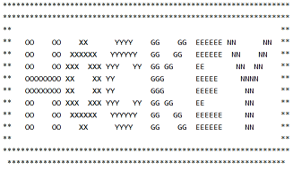

# Challenge #6
**Url**: http://www.pythonchallenge.com/pc/def/channel.html<br/>
## Problem Statement
<br/>

## Resolution
The page header states "now there are pairs" and there is no hint given.<br/>
What we see in the picture is a zip, so this might have something to do with the zip() function or data format.<br/>
Checking the page source we don't find much useful information, so, out of clues, we might as well try replacing the 'html' ending by 'zip' and voilà! We get a zip file.<br/>
<br/>
There is a readme file inside the zip file stating the following:
>welcome to my zipped list.<br/><br/>
>hint1: start from 90052<br/>
>hint2: answer is inside the zip<br/>

As there are many files inside the zip file, we should start automatically searching for clues starting by file "90052.txt", of course python can do this automatically:
```python
import zipfile

with zipfile.ZipFile('channel.zip', 'r') as zip_ref:
    next_step = '90052'

    while True:
        next_file = ''.join((next_step, '.txt'))
        with zip_ref.open(next_file, 'r') as f:
            content = f.read().decode('utf-8')
            print(content)
            try:
                decoding = re.findall('Next nothing is ([0-9]+)', content)
                next_step, = decoding
            except ValueError:
                break

```
Doing so, we end up getting this message:
> Collect the comments.

And so, altering the code above a little bit...
```python
with zipfile.ZipFile('channel.zip', 'r') as zip_ref:
    next_step = '90052'

    while True:
        next_file = ''.join((next_step, '.txt'))

        # Get zip comment from next file
        encoded = zip_ref.getinfo(next_file).comment
        decoding = encoded.decode('utf-8')
        print(*decoding, end='')
        with zip_ref.open(next_file, 'r') as f:
            content = f.read().decode('utf-8')
            # print(content)
            try:
                decoding = re.findall('Next nothing is ([0-9]+)', content)
                next_step, = decoding
            except ValueError:
                break

```
The execution shows the following:
 ><br/>

This might be the clue we were looking for!. However, if we go to http://www.pythonchallenge.com/pc/def/channel.html, this message appears:
> it's in the air. look at the letters. 

So, if we carefully check our previous output, we will see that the clue we were really looking for was in fact OXYGEN!, which leads us to the next challenge in http://www.pythonchallenge.com/pc/def/oxygen.html

