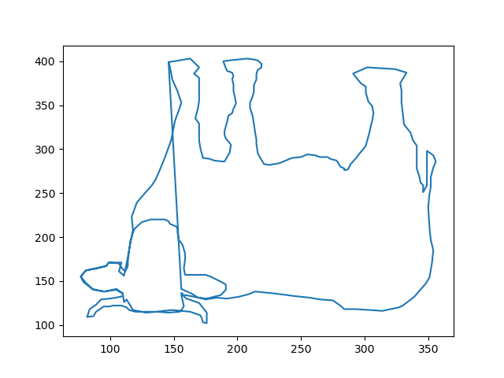

# Challenge #9
**Url**: http://www.pythonchallenge.com/pc/return/good.html
<br/>
## Problem Statement

## Resolution
There is no explicit hint given, but the page header says "connect the dots". Also, the image shows a tree and its shape formed by dots. </br>
Checking the page source, we see 2 lists of numbers, and some kind of hint that says, *'first+second='*.
<br/>
In order to connect points, we need their coordinates. If the lists were of the same lenght, we could think that one represents the Xs and that the other one represents the Ys, but that's not the case.
<br/>
Still, if we closely look at the first elements of the list pair-wisely, we see what could be a succession of coordinates, because of the little increment that would happen between Xs and Ys.
If we unite both list and take previous considerations, we can implement the following:
 

Carefully looking at the numbers, it seems that they are represented in pairs because of the little increments 
```python
import re

import matplotlib.pyplot as plt
import requests
from requests.auth import HTTPBasicAuth

url = 'http://www.pythonchallenge.com/pc/return/good.html'
data = requests.get(url, auth=HTTPBasicAuth('huge', 'file')).content.decode()
match = re.search(r'first:\n([\d,\n]+)\n\nsecond:\n([\d,\n]+)\n\n-->', data)
first, second = [match.group(i).replace('\n', '').split(',') for i in [1, 2]]

first = list(map(int, first))
second = list(map(int, second))

union = first + second
x_vals = union[::2]
y_vals = union[1::2]

plt.plot(x_vals, y_vals)
plt.show() 
```
> 

That looks like a cow right? Well, let's try it at http://www.pythonchallenge.com/pc/return/cow.html
> hmm. it's a male.

LOL, ok dude...<br/>
http://www.pythonchallenge.com/pc/return/bull.html
